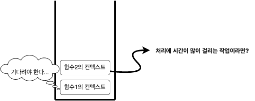

프로그래밍 초창기에 프로그램은 순서대로 실행이 되었다. 이를 **순차적 프로그래밍**이라 한다.
컴퓨터에게 데이터와 루틴을 제공하면 한 번에 하나씩 순서대로 실행해서 결과를 만들고 종료되었다.  

순차적 프로그래밍에서는 프로그램이 파일을 읽거나 네트워크에서 데이터를 가져오려고 하면 데이터를 다 가져올 때까지 프로그램은 실행을 멈춘다. 

이는 컴퓨터가 사용자 또는 컴퓨터와 상호 작용을 해야 할 때는 문제가 된다. 그래서 동시에 여러 가지 일을 할 수 있는 **동시성(Concurrency) 프로그래밍**이 필요해졌다. 

## 스레드
예전에는 프로세스[^1]가 하나였다. 그래서 동시에 여러 작업을 하기 위해선 프로세스가 여러 개 필요했는데, 각 프로세스는 별개로 메모리를 차지 하고 있어 서로 정보 교환이 어려웠다. 
그래서 프로세스 보다 작은 단위인 **스레드**가 생겼다. 스레드는 하나의 프로세스 내에서 실행되는 흐름의 단위다. 프로세서와 달리 스레드들은 프로세스 내의 메모리를 공유해서 사용할 수 있어 정보 교환이 쉬워졌다.

여러 개의 스레드가 코드를 동시에 실행되도록 해주는 언어는 Java, C++ 등이 있다. 여러 개의 코드가 상태에 접근해서 변경할 수 있을 때 그 상태를 유지하고 보호하는 것은 어려운 문제다. 그래서 스레드 기반 소프트웨어에서 잦은 버그의 원인이 된다. 스레드 간 경쟁으로 발생할 수 있는 위험성은 상호 배제[^2]로 줄일 수 있다.   

이에 반해 **자바스크립트는 동시성을 더 나은 방법으로 구현할 수 있다.** 바로 비동기 프로그래밍이다.

## 자바스크립트와 비동기 프로그래밍
자바스크립트에서 함수를 호출하면 함수 [[JavaScript-Execution-Context|실행 컨텍스트]]가 생성된다. 함수 실행 컨텍스트는 실행 컨텍스트 스택(이하 콜 스택)에 푸시되고 함수 코드가 실행된다. 함수 코드의 실행이 종료되면 함수 실행 컨텍스트는 콜 스택에서 팝되어 제거된다.  

**[[JavaScript-Engine|자바스크립트 엔진]]은 단 하나의 콜 스택을 가진다.** 그러므로 함수를 실행할 수 있는 창구가 단 하나이며, 동시에 2개 이상의 함수를 실행할 수 없다. 콜 스택의 최상위 요소인 "실행 중인 컨텍스트"를 제외한 나머지 모든 실행 컨텍스트는 모두 실행 대기 중인 태스크(task)다. 대기 중인 태스크들은 현재 실행 중인 실행 컨텍스트가 콜 스택에서 제거되면 실행되기 시작한다.  

이처럼 자바스크립트 엔진은 한 번에 하나의 태스크만 실행할 수 있는 **싱글 스레드(Single Thread)** 방식으로 동작한다. 그래서 처리에 시간이 걸리는 태스크를 실행할 경우 블로킹(작
업 중단)이 발생한다.  




실행 중인 태스크가 종료할 때까지 다음에 실행될 태스크가 대기하는 방식은 [[Synchronous|동기]]처리이다. 이에 반해 현재 실행 중인 태스크가 종료되지 않은 상태여도 다음 태스크를 곧바로 실행하는 방식을 [[Asynchronous|비동기]]처리라고 한다. 

### 이벤트 루프와 큐 
자바스크립트는 앞서 설명한 것처럼 싱글 스레드로 동작하지만 브라우저의 동작을 살펴보면 태스크들이 동시에 처리되는 것처럼 느껴질 때가 있다.  
예를 들어, 웹 브라우저는 애니메이션 효과를 보여주면서 마우스 입력도 받아서 처리하고, 서버로부터 데이터를 가져오면서 렌더링하기도 하고, Node.js 웹 서버에서는 동시에 여러 개의 HTTP 요청을 처리하기도 한다. 어떻게 스레드가 하나인데 이런 일이 가능할까?  

**자바스크립트의 동시성을 지원하는 것이 바로 이벤트 루프(Event loop)다.** 브라우저에 내장되어 있는 기능 중 하나이다.  
**브라우저 환경은 큐와 이벤트 루프, Web API라는 것을 제공**한다. 

[[JavaScript-Timer|타이머]] 함수, [[HTTP]] 요청([[Ajax]]), [[DOM]] API등의 작업은 Web API에서 처리되어 작업이 완료되면 콜백이 **큐**에 추가된다.

예를 들어, 다음 이미지는 `setTimeout` 코드의 실행을 보여준다.
[[JavaScript-Engine|자바스크립트 엔진]]이 콜 스택에 있는 `setTimeout` 코드를 실행한다. `setTimeout`의 콜백 함수는 타이머가 완료될 때까지 Web API에 추가된다.

[이미지 출처](https://medium.com/gradeup/asynchronous-javascript-event-loop-1c8de41298dd)

타이머가 완료되면 `setTimeout`의 콜백이 큐에 추가된다.

[이미지 출처](https://medium.com/gradeup/asynchronous-javascript-event-loop-1c8de41298dd)

이벤트 루프는 콜 스택에 현재 실행 중인 실행 컨텍스트가 있는지, 그리고 큐에 대기 중인 함수(콜백 함수, 이벤트 핸들러 등)이 있는지 반복해서 확인한다.
만약 콜 스택이 비어 있고 큐에 대기 중인 함수가 있다면 이벤트 루프는 순차적으로 태스크 큐에 대기 중인 함수를 콜 스택으로 이동시킨다. 콜 스택으로 이동한 함수는 실행된다.

[이미지 출처](https://medium.com/gradeup/asynchronous-javascript-event-loop-1c8de41298dd)

이렇게 이벤트 루프와 큐 덕분에 비동기 작업이 가능하게 되는 것이다!

💡 여기서 알고 있어야 하는 사실은, 엔진이 어떤 태스크를 처리하는 동안에는 [[Rendering|렌더링]]은 절대 일어나지 않는다! 처리가 끝나는대로 DOM 변경이 화면에 반영된다.

### 매크로태스크 큐와 마이크로태스크 큐

앞서 설명한 큐는 매크로태스크(macrotask) 큐와 마이크로태스크(microtask)로 나누어진다.

매크로태스크는 지금까지 살펴본 일반 콜백 함수(`setTimeout`, `setInterval` 등을 사용했을 때)나 이벤트 핸들러가 들어가는 "큐"를 의미한다. 

마이크로태스크 큐는 ES6부터 등장한 개념으로, 여러 문서를 찾아보니 잡 큐(Job Queue)라고도 부르기도 한다. [[JavaScript-Promise|Promise]]와 [[MutationObserver]] 등을 통해 들어오는 콜백 함수가 이 마이크로태스크 큐에 추가된다.

자바스크립트 엔진은 매크로태스크 하나를 처리할 때마다 또 다른 매크로태스크나 렌더링 작업을 하기 전에 마이크로태스크 큐에 쌓인 마이크로태스크를 먼저 전부 처리한다.[^3]


[이미지 출처](https://medium.com/gradeup/asynchronous-javascript-event-loop-1c8de41298dd)

매크로태스크 큐가 롤러코스터를 타고 한 번 더 타고 싶어 대기열 맨 끝에서 기다리는 것이라면, 마이크로태스크 큐는 롤러코스터에 내린 직후 대기열 맨 앞에서 곧바로 다시 타는 것이다.[^4](~~새치기?~~)

다시 정리보자.
1. 이벤트 "루프"는 이름에 걸맞게 연속적으로 계속 반복해서 작동을 한다.
2. 이벤트 루프가 콜 스택이 비어있는지 확인한다.
3. 비어 있는 경우, 마이크로태스크 큐의 마이크로태스크를 콜 스택에 추가한다. 마이크로태스크 큐가 비어있을 때까지 이 작업을 계속한다.
4. 마이크로태스크 큐가 비어 있는 경우 매크로태스크 큐에서 가장 오래된 태스크를 콜 스택에 추가한다.

### 화면 렌더링

여기서 궁금한 점이 하나 생겼다. 태스크들이 큐에 추가되고 다시 콜 스택에 들어가서 실행되고...이걸 반복한다면 화면은 언제 렌더링되는 것인가?

[영상](https://www.youtube.com/watch?v=cCOL7MC4Pl0&ab_channel=JSConf)을 하나 발견할 수 있었다. 화면을 렌더링하는 것도 **이벤트 루프**가 관여했다! 
이미지를 확인하면 이벤트 루프는 크게 두 경로로 작동한다.

이미지 상 왼쪽은 앞서 설명한 큐가 비었는지 확인을 하는 것이고, 우측은 렌더링 경로다. (S: 스타일 계산, L: 레이아웃 계산, P: 페인팅)
**브라우저가 화면을 갱신해야겠다고 판단하면 그때 렌더링**에 들어간다.

`requestAnimationFrame`(raF)이라는 API를 사용하면 브라우저에게 수행하기를 원하는 애니메이션(함수)을 알린다. 그리고 다음 렌더링이 되기 전에 해당 함수를 호출한다. 이 콜백 횟수는 초당 60회다(60Hz). 왜냐하면 대부분 스크린은 업데이트 빈도가 설정돼 있어서 1초에 60번 정도 업데이트되기 때문이다. 따라서 이보다 빨라봤자 사용자 눈에는 보일 수 없으니 화면 갱신을 그보다 더 많이 할 필요는 없다.

## 콜백 패턴
아래 코드의 결과를 예상해보자. 아무 고민 없이 코드를 작성한 대로 이해하면  A -> C -> B 순서로 코드가 실행되어야 한다는 생각이 든다:
```javascript
const { readFile } = require("fs");

// A
readFile("test.txt", function (err, contents) {
  if (err) {
    throw err;
  }
  // C
  console.log(contents);
});

// B
console.log("Hello");
```

하지만 A->B->C 순서이다. 즉 `readFile()`이 호출된 후 `console.log(contents)`가 출력되기 전에 `console.log("Hello")`가 출력된다. 

`readFile()`이 실행을 완료하면 큐의 맨 뒤에 콜백 함수와 콜백 함수의 인자를 가진 새로운 태스크가 추가된다. 그 태스크는 앞선 모든 다른 태스크 완료 후에 실행된다. 

사람은 순차적으로 생각하기 때문에 위와 같은 진행 방식에 괴리감이 느껴진다. 그래서 코드는 이해하기 힘들어지고... 디버깅/유지보수가 힘들어진다. 

사람은 계획을 작업할 때 순차적/동기적으로 계획한다. "나는 나중에 이 책을 읽고 나서, 마트에 가서 장을 보고, 밥을 차려 먹을 것이다." 사람의 계획은 형태만 보면 비동기 이벤트 처럼 보이지 않는다. 
```javascript
z = x;
x = y;
y = z;
```
위 코드의 할당문 처럼 하나가 끝나야 다음 줄이 실행되는 식이다. 이렇게 동기 코드 문은 사람의 사고와 잘 어울리는데 비동기 코드는 사고의 흐름과 어울리지 않다. 이래서 비동기 코드 작성에 내가 이질감을 느낀 것 같다. 책[^5]을 읽고나서 많은 생각이 바뀌었다. 사람은 멀티태스커가 아니라 아주 재빠르게 컨텍스트를 교환하고 있다는 점과 그를 위해 인간의 두뇌는 이벤트 루프와 큐처럼 동작한다는 사실을...   
비동기 코드 작성이 어려운 이유는 인간이 비동기 흐름을 생각하고 떠올리는 일 자체가 부자연스럽다는 것! 

콜백 패턴을 사용하면 여러 개의 호출 연결이 쉽기 때문에 이벤트보다 더 유연하다. 하지만 여러 개의 호출을 연결하게 되면 일명 **콜백 지옥(Callback Hell)**에 빠질 수 있다는 단점이 있다. 콜백 지옥은 너무 많은 콜백이 중첩되었을 때 발생한다.  

콜백의 다른 문제점은 복잡한 기능을 구현할 때다. "두 개의 비동기 연산을 병렬로 실행하고 둘 다 완료되었을 때 결과를 알고 싶다.", "두 개의 비동기 연산을 동시에 실행하고 첫 번째 연산이 완료되었을 때만 결과를 알고 싶다." 등의 경우엔 여러 개의 콜백을 추적할 필요가 있다. [[JavaScript-Promise|프로미스]]는 이 문제를 크게 개선한다. 

## reference
- 박수현 역, 더글러스 크락포드 저, 《자바스크립트는 왜 그 모양일까?》, 인사이트, 2020년
- 이웅모 저, 《모던 자바스크립트 Deep Dive》, 위키북스, 2020년
- [자바스크립트와 이벤트 루프](https://meetup.toast.com/posts/89)
- 김두형·정재훈 역, 니콜라스 자카스 저, 《모던 자바스크립트》, 인사이트, 2017년
- 이일웅 역, 카일 심슨 저, 《You Don't Know JS: this와 객체 프로토타입, 비동기와 성능》, 한빛미디어, 2017년

[^1]: 프로그램은 일반적으로 하드 디스크 등에 저장되어 있는 실행코드를 뜻하고, 프로세스는 프로그램을 구동하여 프로그램 자체와 프로그램의 상태가 메모리 상에서 실행되는 작업 단위를 지칭한다. (https://ko.wikipedia.org/wiki/%ED%94%84%EB%A1%9C%EC%84%B8%EC%8A%A4)
[^2]: 상호 배제는 메모리의 임계 구역을 잠그고 스레드를 차단하고, 서로 경쟁하는 코드 실행을 막는 것으로 이루어진다. 임계 구역을 잠그는 비용은 아주 비싸다. 그리고 실행이 차단된 스레드가 잠금을 해제하지 못하는 경우도 발생하는데 이를 데드락이라고 한다.
[^3]: https://ko.javascript.info/event-loop
[^4]: 이일웅 역, 카일 심슨 저, 《You Don't Know JS: this와 객체 프로토타입, 비동기와 성능》, 한빛미디어, 2017년, 199쪽
[^5]: 이일웅 역, 카일 심슨 저, 《You Don't Know JS: this와 객체 프로토타입, 비동기와 성능》, 한빛미디어, 2017년