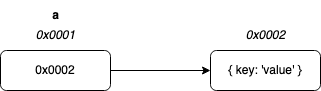
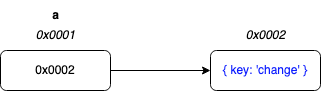
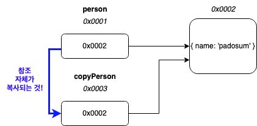
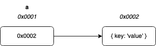
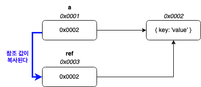
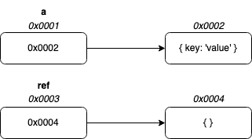
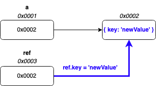

## 객체란?  
- 객체는 자바스크립트를 구성하는 기본 데이터구조다.
- [[JavaScript|자바스크립트]]에서 [[JavaScript-Data-Type|원시 값]]을 제외한 나머지 값은 모두 객체다.  
	- 원시 타입은 하나의 값만을 나타내지만 **객체 타입은 다양한 타입의 값(원시 값 또는 다른 객체)을 하나의 단위로 구성한 복합적인 자료구조**다.   

다음 코드는 [[JavaScript-Object-Literal|객체 리터럴]]로 객체를 생성한 예시다:
```javascript
let user = {     // 객체
  name: "John",  // 프로퍼티, 키: "name",  값: "John" 
  age: 30        // 프로퍼티, 키: "age", 값: 30
  sayHello: function() {
    alert("안녕하세요!")
  }
};
```

- 객체는 프로퍼티들을 가지고 있다. 
	- 각 프로퍼티에는 이름(키, key)과 값이 있다.
		- 프로퍼티 키는 문자열, 값은 자바스크립트에서 사용할 수 있는 어떤 자료형도 가능하다.
		- 함수도 [[JavaScript-First-Class-Object|일급 객체]]이므로 값으로 취급할 수 있다. **프로퍼티 값이 함수일 경우 일반 함수와 구분하기 위해 메서드(method)라고 부른다.**

객체의 집합으로 프로그램을 표현하려는 프로그래밍 [[Paradigm|패러다임]]을 [[Object-Oriented-Programming|객체 지향 프로그래밍]]이라고 한다. 

## 객체 생성하기 
자바스크립트는 다양한 객체 생성 방법을 지원한다. 
- [[JavaScript-Object-Literal|객체 리터럴]]
- [[JavaScript-Constructor-Function|Object 생성자 함수]]
- [[JavaScript-Constructor-Function|생성자 함수]]
- `Object.create` 메서드
	- `Object.create()`를 사용하면 이미 있는 객체를 전달받아서 이를 상속받는 새로운 객체를 반환한다. 
	- `Object.create(null)`을 쓰면 아무것도 상속받지 않은 객체를 만들 수 있다.
- [[JavaScript-Class|클래스(ES6)]]

[[JavaScript-Object-Literal|객체 리터럴]] 외의 방법들은 모두 [[JavaScript-Function|함수]]를 이용해 객체를 생성한다.  

## 원시 값과 비교하기 
### 원시 타입과 객체 타입의 다른점 
1. 원시 타입의 값, **원시 값은 불변 값(immutable value)**이고 **객체 타입의 값은 변경 가능 값(mutable value)**이다. 
2. 원시 값을 변수에 할당하면 변수에는 실제 값이 저장되고 객체는 참조 값이 저장된다.
3. 원시 값을 갖는 변수를 다른 변수에 할당하면 원시 값이 복사되어 전달(값에 의한 전달)되고 객체를 가리키는 변수를 다른 변수에 할당하면 원본 참조 값이 복사되어 전달(참조에 의한 전달)된다.  

### 원시 값이란 
- 불변 값
	- 읽기 전용으로 바꿀 수 없다는 말 (변수가 아닌 값 자체가!)
	- 변경 불가능하기 때문에 데이터의 신뢰성을 보장 
- 변수에 할당할 때 
	- 원시 값이 할당된 변수에 새로운 원시 값을 할당하려하면, 이미 저장된 원시 값을 변경하는 것이 아니라 새로운 메모리 공간을 확보한 뒤 재할당한 원시 값을 그곳에 저장하고 변수는 새롭게 재할당한 값을 가리키는 것 
	- 변수가 참조하던 메모리 공간의 주소가 변경된 이유가 바로 원시 값이 변경 불가능한 값이기 때문이다. 
- 마약 원시 값이 변경 가능한 값이라면 예기치 않게 변수 값이 변경될 수 있다는 것을 의미한다. → 값의 변경을 추적하기 어렵게 한다.  


ex) 원시 타입의 예: 문자열
원시 타입이기 때문에 배열처럼 문자 변경을 할 수 없다:
```javascript
let word = 'hello';
word[0] = 'z';
console.log(word); // hello 
```

### 원시 타입의 값에 의한 전달, pass by value 
```javascript
let score = 100;

let copyScore = score; 

console.log(score, copyScore); // 100 100
console.log(score === copyScore); // true 
```
- 변수(`copyScore`)에 원시 값을 갖는 변수(`score`)를 할당하면 할당받는 변수(`copyScore`)는 할당되는 변수(`score`)의 **원시 값이 복사되어 전달된다. → 값에 의한 전달** 
- 두 변수 다 `100`이라는 값을 갖지만 다른 메모리 공간에 저장된 별개의 값이다. 
- 값에 의한 전달이란 용어는 ECMAScript 사양엔 등장하지 않는다. → 다른 언어에서 많이 사용하는 용어 
	- 또한 값이 전달되기 보다는 명확하게 표현하면 메모리 주소가 전달된다. 변수에는 값 그 자체가 저장되는 것이 아닌 메모리 주소가 저장되기 때문이다! 전달된 메모리 주소를 통해 메모리 공간에 접근하면 값을 얻을 수 있다.

### 객체 타입의 참조에 의한 전달, pass by 'copy of reference'

객체 타입의 값은 **변경 가능한 값(mutable value)**이다.  

원시 값을 할당한 변수의 경우, 변수가 기억하는 메모리 주소를 통해서 원시 값에 접근할 수 있지만, 객체는 할당한 변수가 기억하는 메모리 주소를 통해 **참조 값**에 접근할 수 있다.  

참조 값(reference value)이란, 생성된 객체가 저장된 메모리 공간의 주소이다.  	
```js
const a = {
  key: 'value'
};
```

위 코드는 다음 그림처럼 표현이 된다.(메모리 주소는 임의로 정했다.)



객체를 할당한 변수는 `변수는 객체를 참조하고 있다.` `변수는 객체를 가리키고 있다.` 라고 표현한다.  

**원시 값은 변경 불가능한 값이므로 변수 값을 변경하려면 재할당을 해야 하고, 객체는 재할당 없이 직접 변경이 가능하다.** 재할당을 한 것이 아니므로, 객체를 할당한 변수의 참조 값은 그대로다.
```js
const a = {
  key: 'value'
};

a.key = 'change';
```


- 객체는 크기가 매우 클 수도 있고 크기가 일정하지 않을 수도 있고, 프로퍼티가 객체일 수도 있어서 원시 값처럼 복사해서 새로 재할당 하는 것은 비용이 클 수 있다. → 비효율적인 것 
	- 그래서 메모리를 효율적으로 사용하기 위해, 성능 향상을 위해 변경 가능한 값으로 설계된 것이다.  


#### 참조에 의한 전달의 부작용 
```javascript
let person = {
    name: 'padosum'
};

// 참조 값 복사하기 (얕은 복사)
let copyPerson = person; 

person.name = '이름을 변경해버리기';

console.log(copyPerson.name); // 이름을 변경해버리기
```  
`person`과 `copyPerson`은 동일한 참조 값, 즉 동일한 객체를 가리킨다. 
- 두 식별자가 하나의 객체를 공유한다는 것 
- 따라서 변수가 객체를 변경하게 되면 둘 다 영향을 받는다.  




"값에 의한 전달", "참조에 의한 전달" 모두 식별자가 기억하는 메모리 공간에 저장되어 있는 값을 복사한다는 점은 동일하다. 하지만 식별자가 기억하는 메모리 공간이 원시 값인지 참조 값인지가 다른 것. 

따라서 "참조에 의한 전달" 보다는 "참조 자체가 값으로 전달"이므로 자바스크립트에서는 "참조에 의한 전달"은 존재하지 않고 "값에 의한 전달"만 존재한다.

이해를 위해 조금 더 살펴보자. [코드 출처](https://stackoverflow.com/questions/13104494/does-javascript-pass-by-reference)
```js
function replace(ref) {
    ref = {};
}

function update(ref) {
    ref.key = 'newvalue';
}

const a = { key: 'value' };
replace(a);
update(a);
```



`a`라는 상수를 선언했다. 이번에도 주소는 임의로 정했다. `{ key: 'value'} `라는 객체의 주소를 참조하고 있다.

`replace` 함수는 다음 그림과 같이 동작할 것이다:


같은 객체를 바라보고 있다. 그 후에 `ref`에 `{}`를 할당한다. 그럼 새로운 객체를 참조하게 된다:



이번엔 `update` 함수를 살펴보자. 처음에 파라미터를 전달했을 때 `replace` 함수와 마찬가지로 참조 값을 복사한다.


`ref` 변수는 같은 객체를 참조하고 있다. 그리고 해당 객체의 프로퍼티 값을 변경한다.



## 객체 복사에 대하여 
객체를 프로퍼티로 갖는 객체를 복사할 때, 
- 얕은 복사: 한 단계까지만 복사
- 깊은 복사: 객체에  중첩된 객체가지 모두 복사하는 것을 말한다. 
- 얕은 복사와 깊은 복사로 생성된 객체는 원본 객체와 다른 객체다. → 원본 객체와 참조 값이 다르다.  
- 얕은 복사는 객체에 중첩된 객체의 경우 참조 값을 복사하고, 깊은 복사는 중첩된 객체까지 모두 복사한다.

##### 더 알아보기 
- [깊은 복사와 얕은 복사에 대한 심도있는 이야기](https://medium.com/watcha/%EA%B9%8A%EC%9D%80-%EB%B3%B5%EC%82%AC%EC%99%80-%EC%96%95%EC%9D%80-%EB%B3%B5%EC%82%AC%EC%97%90-%EB%8C%80%ED%95%9C-%EC%8B%AC%EB%8F%84%EC%9E%88%EB%8A%94-%EC%9D%B4%EC%95%BC%EA%B8%B0-2f7d797e008a)

## 더 알아보기
- [[JavaScript-Property-Attributes]]

## reference
- [모던 자바스크립트 Deep Dive](http://www.kyobobook.co.kr/product/detailViewKor.laf?ejkGb=KOR&mallGb=KOR&barcode=9791158392239&orderClick=LEa&Kc=)
- [모던 JavaScript 튜토리얼](https://ko.javascript.info/)
- [프론트엔드 개발자를 위한 자바스크립트 프로그래밍](http://www.kyobobook.co.kr/product/detailViewKor.laf?ejkGb=KOR&mallGb=KOR&barcode=9788966260768&orderClick=LAG&Kc=) 
- [자바스크립트 완벽 가이드](http://www.kyobobook.co.kr/product/detailViewKor.laf?ejkGb=KOR&mallGb=KOR&barcode=9788966261796&orderClick=LAG&Kc=)
